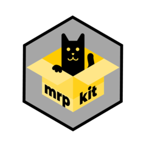

# mrpkit 

**NOTE: This package is still a work in progress and is yet not released or officially supported**

<!-- badges: start

<!-- badges to enable once on CRAN in the future

 -->
 

<!-- badges: end -->

# mrpkit

This package implements a structured workflow for Multilevel Regression and Poststratification (MRP). The package assists in setting up the survey data and relationships between different variables in the sample and the population. From there, a substantial amount of data cleaning is automated, saving time and reducing the risk of coding errors. The package has native support for multilevel binomial and bernoulli models fit with lme4 and Stan (via brms and rstanarm) and also allows for the use of custom modeling functions. Summaries and simple visualizations of the resulting post-stratified estimates are provided.

### License 

Licensed under an MIT license. See the `LICENSE.md` file.
