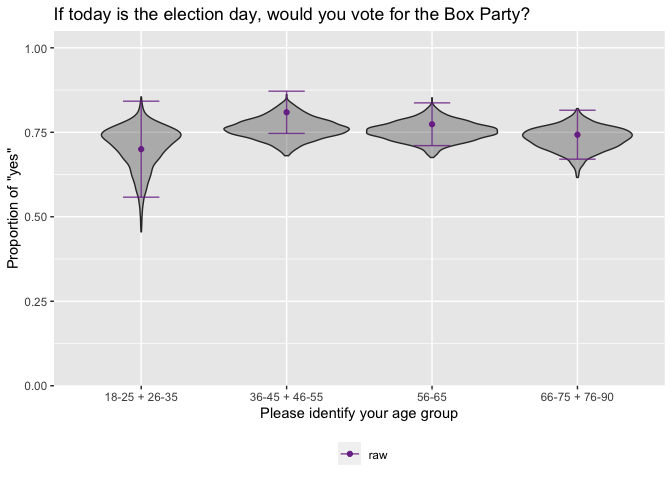
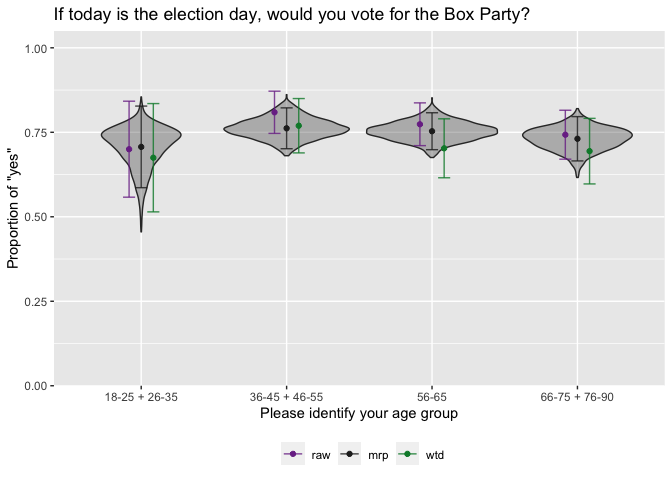

<!-- README.md is generated from README.Rmd. Please edit that file -->

# mrpkit

<!-- badges: start -->

[](https://CRAN.R-project.org/package=mrpkit)
[](https://github.com/lauken13/mrpkit/actions/workflows/R-CMD-check.yaml)
[](https://app.codecov.io/gh/lauken13/mrpkit?branch=master)
<!-- badges: end -->

**NOTE: This package is still a work in progress and is yet not released
or officially supported**

For students and researchers who are comfortable with at least `glm()`
and want to conduct multilevel regression with post-stratification
(MRP), `mrpkit` provides a reproducible, opinionated, and highly
structured workflow. Unlike writing all the code yourself, using
`mrpkit` proactively addresses many common issues, and makes it possible
for folks who are new to MRP to quickly conduct their first analysis.

The package assists in setting up the survey data and relationships
between different variables in the sample and the population. From
there, a substantial amount of data cleaning is automated, saving time
and reducing the risk of coding errors. The package has native support
for multilevel binomial and Bernoulli models fit with lme4 and Stan (via
brms and rstanarm) and also allows for the use of custom modeling
functions. Summaries and simple visualizations of the resulting
post-stratified estimates are provided.

## Installation

You can install the development version of `mrpkit` from GitHub:

``` r
# install.packages("remotes")
remotes::install_github("lauken13/mrpkit")
```

### License

`mrpkit` is licensed under an MIT license. See the `LICENSE.md` file.

## Example

``` r
library(mrpkit)

# Some fake survey data for demonstration
head(shape_survey)
#>     age gender     vote_for   highest_educ   state   y        wt
#> 1 56-65   male           BP   some college State D  no  79.90290
#> 2 46-55   male Circle Party 4-year college State B yes  89.12213
#> 3 36-45   male Circle Party     associates State D  no  92.90569
#> 4 18-25   male    Box Party    high school State B yes  80.78384
#> 5 56-65 female           BP    high school State A yes  89.85756
#> 6 56-65 female Circle Party 4-year college State B yes 117.04200

# Create SurveyData object for the sample
box_prefs <- SurveyData$new(
  data = shape_survey,
  questions = list(
    age = "Please identify your age group",
    gender = "Please select your gender",
    vote_for = "Which party did you vote for in the 2018 election?",
    y = "If today is the election day, would you vote for the Box Party?"
  ),
  responses = list(
    age = levels(shape_survey$age),
    gender = levels(shape_survey$gender),
    # Here we use a dataframe for the responses because the levels in the data are abridged versions of the actual responses
    # This can be useful when surveys have brief/non descriptive responses.
    vote_for = data.frame(data = levels(shape_survey$vote_for),
    asked = c("Box Party Faction A", "Box Party Faction B", "Circle Party Coalition", "Circle Party")),
    y = c("no","yes")
  ),
  weights = "wt",
  design = list(ids =~1)
)
box_prefs$print()
#> Survey with 500 observations, 4 questions 
#> Independent Sampling design (with replacement) 
#> 
#> Column label: age 
#> Question: Please identify your age group 
#> Allowed answers: 18-25, 26-35, 36-45, 46-55, 56-65, 66-75, 76-90 
#> 
#> Column label: gender 
#> Question: Please select your gender 
#> Allowed answers: male, female, nonbinary 
#> 
#> Column label: vote_for 
#> Question: Which party did you vote for in the 2018 election? 
#> Allowed answers: Box Party ( Box Party Faction A ), BP ( Box Party Faction B ), Circle Party ( Circle Party Coalition ), CP ( Circle Party ) 
#> 
#> Column label: y 
#> Question: If today is the election day, would you vote for the Box Party? 
#> Allowed answers: no, yes
box_prefs$n_questions()
#> [1] 4


# Some fake population data for demonstration
head(approx_voters_popn)
#>   age_group gender vote_pref        wt       education state
#> 1       66+      m        BP  6.007461 4-years college     A
#> 2     56-65      f        CP  8.465851     high school     A
#> 3     56-65      m        CP  4.098878 4-years college     C
#> 4       66+      m        BP  3.883250 4-years college     C
#> 5       66+      f        CP 16.179562    some college     B
#> 6     18-35      m        BP  3.851837     high school     D

# Create SurveyData object for the population
popn_obj <- SurveyData$new(
  data = approx_voters_popn,
  questions = list(
    age_group = "Which age group are you?",
    gender = "Gender?",
    vote_pref = "Which party do you prefer to vote for?"
  ),
  # order doesn't matter (gender before age here) because
  # the list has the names of the variables
  responses = list(
    gender = levels(approx_voters_popn$gender),
    age_group = levels(approx_voters_popn$age_group),
    vote_pref = levels(approx_voters_popn$vote_pref)
  ),
  weights = "wt"
)
popn_obj$print()
#> Survey with 5000 observations, 3 questions 
#> Independent Sampling design (with replacement) 
#> 
#> Column label: age_group 
#> Question: Which age group are you? 
#> Allowed answers: 18-35, 36-55, 56-65, 66+ 
#> 
#> Column label: gender 
#> Question: Gender? 
#> Allowed answers: m, f, nb 
#> 
#> Column label: vote_pref 
#> Question: Which party do you prefer to vote for? 
#> Allowed answers: BP, CP


# Create the QuestionMap objects mapping each question between the
# survey and population dataset
q_age <- QuestionMap$new(
  name = "age",
  col_names = c("age","age_group"),
  values_map = list(
    "18-25" = "18-35", "26-35" = "18-35","36-45" = "36-55",
    "46-55" = "36-55", "56-65" = "56-65", "66-75" = "66+", "76-90" = "66+"
  )
)
print(q_age)
#> -------------- 
#> age 
#> age = age_group 
#> -------------- 
#> 18-25 = 18-35 
#> 26-35 = 18-35 
#> 36-45 = 36-55 
#> 46-55 = 36-55 
#> 56-65 = 56-65 
#> 66-75 = 66+ 
#> 76-90 = 66+

q_party_pref <- QuestionMap$new(
  name = "party_pref",
  col_names = c("vote_for","vote_pref"),
  values_map = list("Box Party" = "BP",  "BP" = "BP","Circle Party" = "CP", "CP" = "CP")
)
q_gender <- QuestionMap$new(
  name = "gender",
  col_names = c("gender", "gender"),
  values_map = list("male" = "m","female" = "f", "nonbinary" = "nb")
)


# Create SurveyMap object adding all questions at once
ex_map <- SurveyMap$new(
  sample = box_prefs,
  population = popn_obj,
  q_age,
  q_party_pref,
  q_gender
)
#> Warning: Variable(s) 'education', 'state' are available in the population but
#> won't be used in the model
print(ex_map) # or ex_map$print()
#> ============== 
#> age = age_group 
#> -------------- 
#> 18-25 = 18-35 
#> 26-35 = 18-35 
#> 36-45 = 36-55 
#> 46-55 = 36-55 
#> 56-65 = 56-65 
#> 66-75 = 66+ 
#> 76-90 = 66+ 
#> ============== 
#> vote_for = vote_pref 
#> -------------- 
#> Box Party = BP 
#> BP = BP 
#> Circle Party = CP 
#> CP = CP 
#> ============== 
#> gender = gender 
#> -------------- 
#> male = m 
#> female = f 
#> nonbinary = nb

# Or can add questions incrementally
ex_map <- SurveyMap$new(sample = box_prefs, population = popn_obj)
print(ex_map)
#> ============== 
#> empty mapping

ex_map$add(q_age, q_party_pref)
#> Warning: Variable(s) 'gender', 'education', 'state' are available in the
#> population but won't be used in the model
print(ex_map)
#> ============== 
#> age = age_group 
#> -------------- 
#> 18-25 = 18-35 
#> 26-35 = 18-35 
#> 36-45 = 36-55 
#> 46-55 = 36-55 
#> 56-65 = 56-65 
#> 66-75 = 66+ 
#> 76-90 = 66+ 
#> ============== 
#> vote_for = vote_pref 
#> -------------- 
#> Box Party = BP 
#> BP = BP 
#> Circle Party = CP 
#> CP = CP

ex_map$add(q_gender)
#> Warning: Variable(s) 'education', 'state' are available in the population but
#> won't be used in the model
print(ex_map)
#> ============== 
#> age = age_group 
#> -------------- 
#> 18-25 = 18-35 
#> 26-35 = 18-35 
#> 36-45 = 36-55 
#> 46-55 = 36-55 
#> 56-65 = 56-65 
#> 66-75 = 66+ 
#> 76-90 = 66+ 
#> ============== 
#> vote_for = vote_pref 
#> -------------- 
#> Box Party = BP 
#> BP = BP 
#> Circle Party = CP 
#> CP = CP 
#> ============== 
#> gender = gender 
#> -------------- 
#> male = m 
#> female = f 
#> nonbinary = nb


# Create the mapping between sample and population
ex_map$mapping()

# Create the poststratification data frame using all variables in the mapping
# (alternatively, can specify particular variables, e.g. tabulate("age"))
ex_map$tabulate()

# Take a peak at the poststrat data frame
head(ex_map$poststrat_data())
#> # A tibble: 6 × 4
#>   age           party_pref        gender       N_j
#>   <fct>         <fct>             <fct>      <dbl>
#> 1 18-25 + 26-35 Box Party + BP    male      1697. 
#> 2 18-25 + 26-35 Box Party + BP    female    1578. 
#> 3 18-25 + 26-35 Box Party + BP    nonbinary   90.1
#> 4 18-25 + 26-35 Circle Party + CP male      2358. 
#> 5 18-25 + 26-35 Circle Party + CP female    2414. 
#> 6 18-25 + 26-35 Circle Party + CP nonbinary   76.0


# Fit regression model using rstanarm (returns a SurveyFit object)
fit_1 <- ex_map$fit(
  fun = rstanarm::stan_glmer,
  formula = y ~ (1|age) + (1|gender),
  family = "binomial",
  seed = 1111,
  chains = 1, # just to keep the example fast and small
  refresh = 0 # suppress printed sampling iteration updates
)

# To use lme4 or brms instead of rstanarm you would use: 
# Example lme4 usage
# fit_2 <- ex_map$fit(
#   fun = lme4::glmer,
#   formula = y ~ (1|age) + (1|gender),
#   family = "binomial"
# )

# Example brms usage
# fit_3 <- ex_map$fit(
#   fun = brms::brm,
#   formula = y ~ (1|age) + (1|gender),
#   family = "bernoulli",
#   seed = 1111
# )


# Predicted probabilities
# returns matrix with rows for poststrat cells, cols for posterior draws
poststrat_estimates <- fit_1$population_predict()

# Compute and summarize estimates by age level and party preference
estimates_by_age <- fit_1$aggregate(poststrat_estimates, by = "age")
estimates_by_party <- fit_1$aggregate(poststrat_estimates, by = "party_pref")

fit_1$summary(estimates_by_age)
#>         mean         sd           age method
#> 1  0.7068199 0.06160413 18-25 + 26-35    mrp
#> 2  0.7618569 0.03083377 36-45 + 46-55    mrp
#> 3  0.7532165 0.02787924         56-65    mrp
#> 4  0.7308444 0.03343748 66-75 + 76-90    mrp
#> 5  0.7000000 0.07245688 18-25 + 26-35    raw
#> 6  0.8092105 0.03187030 36-45 + 46-55    raw
#> 7  0.7738095 0.03227747         56-65    raw
#> 8  0.7428571 0.03693821 66-75 + 76-90    raw
#> 9  0.6747594 0.08175135 18-25 + 26-35    wtd
#> 10 0.7694383 0.04102578 36-45 + 46-55    wtd
#> 11 0.7026666 0.04450614         56-65    wtd
#> 12 0.6942291 0.04950014 66-75 + 76-90    wtd
fit_1$summary(estimates_by_party)
#>        mean         sd        party_pref method
#> 1 0.7407729 0.02243509    Box Party + BP    mrp
#> 2 0.7440794 0.02206195 Circle Party + CP    mrp
#> 3 0.7405858 0.02835213    Box Party + BP    raw
#> 4 0.7969349 0.02490054 Circle Party + CP    raw
#> 5 0.6947681 0.03732836    Box Party + BP    wtd
#> 6 0.7355766 0.03393673 Circle Party + CP    wtd

# Plot estimates
fit_1$plot(estimates_by_party)
```


``` r

fit_1$plot(estimates_by_age)
```


``` r

fit_1$plot(estimates_by_age, additional_stats = "none")
```


``` r
fit_1$plot(estimates_by_age, additional_stats = "wtd")
```


``` r
fit_1$plot(estimates_by_age, additional_stats = "raw")
```



``` r
fit_1$plot(estimates_by_age, additional_stats = c("wtd","raw","mrp"))
```



``` r

# Compute and summarize the population estimate
estimates_popn <- fit_1$aggregate(poststrat_estimates)
fit_1$summary(estimates_popn)
#>        mean         sd method
#> 1 0.7427626 0.02220291    mrp
#> 2 0.7700000 0.01882020    raw
#> 3 0.7188127 0.02520815    wtd

# Plot population estimate
fit_1$plot(estimates_popn)
```


``` r
fit_1$plot(estimates_popn, additional_stats = "none")
```


``` r
fit_1$plot(estimates_popn, additional_stats = "wtd")
```


``` r
fit_1$plot(estimates_popn, additional_stats = "raw")
```


``` r
fit_1$plot(estimates_popn, additional_stats = c("wtd","raw","mrp"))
```


