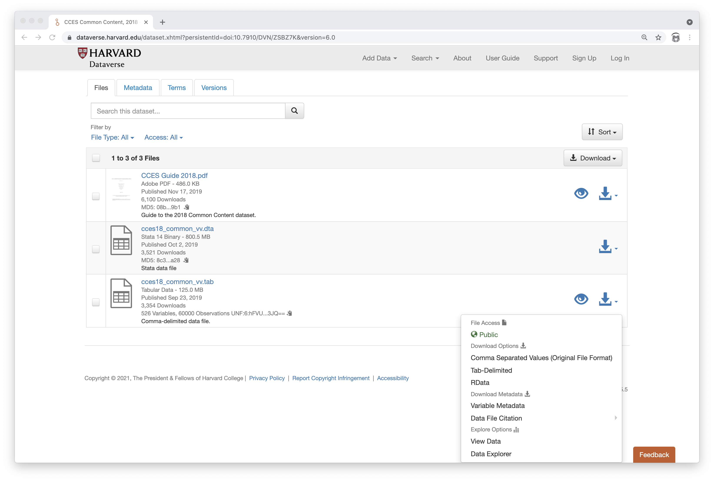
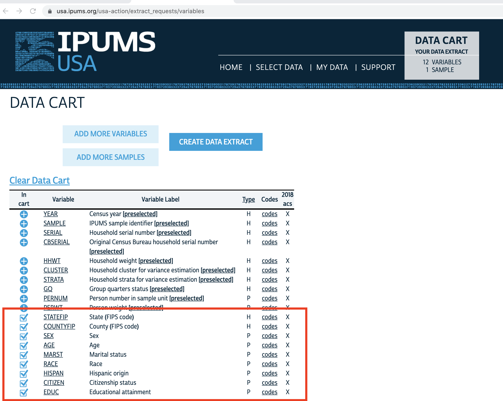
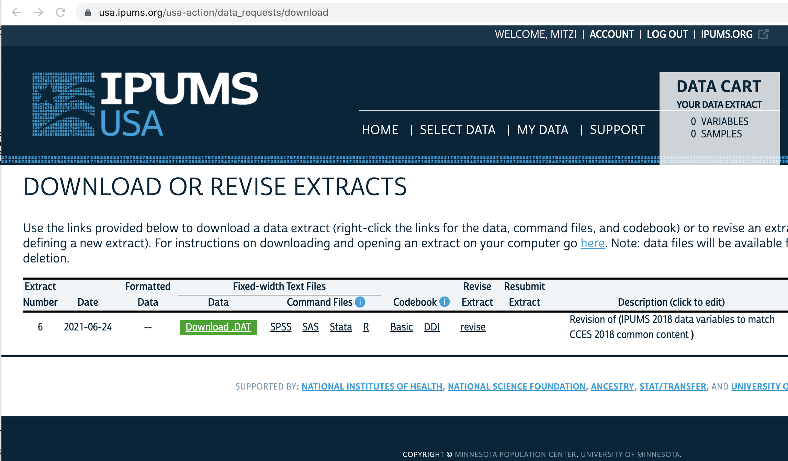

```{r setup, include=FALSE}
knitr::opts_chunk$set(cache=TRUE, message=FALSE, error=FALSE, warning=FALSE, comment=NA, out.width='95%', collapse=TRUE, prompt=TRUE, highlight=FALSE)
options(digits=2)
if (!require("ipumsr")) stop("This case study requires ipumsr package. It can be installed using the following command: install.packages('ipumsr')")
if (!require("labelled")) stop("This case study requires labelled package. It can be installed using the following command: install.packages('labelled')")
library(ipumsr)
library(labelled)
```

<style type="text/css">
.table { width: 85%; }
div.quote-container blockquote {  font-size: small; }
blockquote {  font-size: small; }
</style>

Multi-level Regresssion and Postrativication (MRP)
is a two-step process for correcting model estimates
obtained from a survey sample when the survey population is not
the same as the target population over which we wish to do inference.
The first step is the doing a multilevel regression on the survey sample;
the second step is poststratification to the target population.
Conceptually, MRP is relatively simple.
In practice, it requires more than twice as much data processing.
In addition to managing the survey data, you must also obtain
and manage the target population data.
Most importantly, you must develop a mapping between information
in these two datasets.
In order to produce verifiable, replicable results, it is
critical that this mapping be documented and scripted.

The goal of this case study is to show how the MRP-KIT package
can facilitate this process for large-scale surveys.
By large-scale surveys, we mean surveys which have both
a large number of respondants and detailed demographic profiles for each respondant.
The larger the number of demographics, the larger the number
of possible sub-populations of interest and the more difficult it becomes
to collect a representative sample for all such subpopulations,
thus even well-designed surveys can require use of MRP.

In this case study, the survey data comes from
the 2018 Cooperative Congressional Election Study (CCES),
a bi-annual survey of of 60,000 American adults from
all 50 states and the District of Columbia.
The CCES is designed to capture 
the views and experiences of Amercians with respect to Congress
and congressional (and presidential) elections.
The population data comes from the 2018 American Community Survey (ACS),
the annual micro-census conducted by the US Census Bureau.  It is designed
to be a representative sample of the US population as a whole; data is
collected from 3 million households.

Big data is precious data, but a researcher's time is even more precious.
A secondary goal of this case study is showing how to work effectively
and efficiently with large surveys to produce replicable results.

# Survey data: the 2018 CCES Common Content Dataset

The zero-th step in any data analysis is obtaining the data and checking its contents.
When working with your own data, you have already done this.
When working with someone else's data, you need to understand
both the contents of the dataset and its structure.

The 2018 CCES Common Content Dataset is 
available from the [Harvard Dataverse](https://dataverse.harvard.edu/dataset.xhtml?persistentId=doi%3A10.7910/DVN/ZSBZ7K).
The Common Content portion of the survey consists of questions asked of all subjects.
Profile questions provide demographic information
and opinion questions provide outcomes of interest.

The raw survey data is distributed in several formats from the Harvard Dataverse
as  [cces18_common_vv](https://dataverse.harvard.edu/file.xhtml?persistentId=doi:10.7910/DVN/ZSBZ7K/C1YVSF&version=6.0).
While the tabular versions of the data file are smaller, the Stata version `cces18_common_vv.dta`
contains metadata on all the questions: the question name, label, description, response labels and values.
The corresponding 
[2018 CCES Guide](https://sda.berkeley.edu/sdaweb/docs/cces2018/DOC/CCES+Guide+2018.pdf)
provides a human-readable version of this metadata as well.

```{r ccesDownload, echo=FALSE, out.width = "75%", fig.cap="Harvard Dataverse download page"}
library(knitr)

```

We download the Stata file because we will need the metatdata to map the CCES sample to the ACS using MRP-KIT,
then use the package [`readstata13`](https://www.rdocumentation.org/packages/readstata13/versions/0.10.0)
function [`read.dta13`](https://www.rdocumentation.org/packages/readstata13/versions/0.10.0/topics/read.dta13)
to load the Stata file into R.
The result is an R data.frame with attributes containing the metadata.
```{r}
library(readstata13)
cces_2018 = read.dta13("cces18_common_vv.dta", convert.factors = T, nonint.factors = T, generate.factors=T)
```

Fist we check the type, shape and contents of the sample.
```{r}
str(cces_2018, max.level=2, list.len=12, give.attr=FALSE)
dim(cces_2018)
names(cces_2018)[1:12]
```

The `read.dta13` creates attributes corresponding to the Stata file metadata.
```{r}
names(attributes(cces_2018))
```
The attribute `names` corresponds to the dataframe column names.
```{r}
attr(cces_2018, "names")[1:10]
```
The attribute `val.labels` provides a short description of that columns.
```{r}
attr(cces_2018, "var.labels")[1:10]
```
For questions which have categorical responses, the attribute `label.table`
provides the category name and interger code used for that survey question.
```{r}
attr(cces_2018, "label.table")[["gender"]]
```
The demographic variables include
gender, education level, race, and geographic location, among others.
```{r}
table(cces_2018$gender[,drop=TRUE])
table(cces_2018$educ[,drop=TRUE])
table(cces_2018$race[,drop=TRUE])
```

The political opinion questions on the survey are labelled "President 2016", "Abortion", "Immigration", "Taxes", "Health Care".
```{r}
attr(cces_2018, "var.labels")[which(startsWith(attr(cces_2018, "var.labels"), "President 20"))]
pres_vote <- which(startsWith(attr(cces_2018, "var.labels"), "President 20"))
table(cces_2018[[pres_vote]][,drop=TRUE], useNA="always")
attr(cces_2018, "var.labels")[which(startsWith(attr(cces_2018, "var.labels"), "Health Care --"))[1]]
health_care_Q1 <- which(startsWith(attr(cces_2018, "var.labels"), "Health Care --"))[1]
table(cces_2018[[health_care_Q1]][,drop=TRUE], useNA="always")
```

Of the 525 columns in the survey, we are interested in the set of political opinion questons
and a subset of the demographics.  We create a new dataframe
which contains just these columns of interest.
Using the survey metadata, we select demographics by column names and political opinion questions by the column labels.
In order to properly postratify, we remove any record where there is missing demographic information.
In addition, so that we can easily align the CCES variables with the ACS variables
we removed unused category labels.

```{r}
col_labels <- attr(cces_2018, "var.labels")
col_names <- attr(cces_2018, "names")

demo_cols <- c(which(col_names == "birthyr"),
              which(col_names == "gender" ),
              which(col_names == "educ"),
              which(col_names == "race"),
              which(col_names == "hispanic"),
              which(col_names == "marstat"),
              which(col_names == "inputstate"))
keep_rows <- complete.cases(cces_2018[, demo_cols]) # no missing demographics

outcome_cols <- c(which(startsWith(col_labels, "Abortion --")),
                 which(startsWith(col_labels, "Immigration --")),
                 which(startsWith(col_labels, "Taxes --")),
                 which(startsWith(col_labels, "Health Care --")),
                 which(startsWith(col_labels, "President 20")))
keep_cols <- sort(c(demo_cols, outcome_cols))

cces_2018_subset <- subset(cces_2018, keep_rows, keep_cols)
# `subset` drops attributes, keep attribute "var.labels"
attr(cces_2018_subset, "var.labels") <- attr(cces_2018, "var.labels")

# cleanup factor variables; drop unused category labels
for (name in names(cces_2018_subset)) {
    if (is.factor(cces_2018_subset[[name]]))  {
        cces_2018_subset[[name]] = droplevels(cces_2018_subset[[name]])
    }
}
```

We inspect the subset to make sure that we have captured the question and response names.
```{r}
str(cces_2018_subset, max.level=2, list.len=12, give.attr=FALSE)
```

The CCES has 60,000 respondants.
According to the [Guide to the 2018 Cooperative Congressional Election Survey](https://sda.berkeley.edu/sdaweb/docs/cces2018/DOC/CCES+Guide+2018.pdf)

>This study constructed a very large sample capable of capturing variation across a wide variety of legislative constituencies. In fact, the state-level samples are sufficiently large as to measure with a reasonable degree of precision the distribution of voters’ preferences within most states.

While the CCES data may be roughly representative of the state-level political sentiment as a whole,
if we seek to understand certain subsets of the population,
it is unlikely to be representative of those groups.
There are over 2 million
possible combinations of gender, education,
race, marital status, birthyear, and state of residence.
If we bin ages by decade, there are a mere 200,000 combinations,
binning states by region further reduces this to 16,000, etc., etc.
However, if we wish to consider state-level subpopulations of interest,
the survey data is likely to be sparse and not representative of the general population.
To address the former we do multi-level modeling; for the latter, poststratification.


# Population data:  the 2018 American Community Survey

The US Census data is the largest representative survey of the US population that we have access to.
A full census is conducted every 10 years.
The American Community Survey (ACS) is a micro-census conducted every year by the Census Bureau
over 1% of the households in the US, i.e., it has 3 million respondants (as opposed to 300 million in the full census).

The [Integrated Public Use Microdata Series (IPUMS)](https://ipums.org/what-is-ipums) (@ipums2020) is a service run by the University of Minnesota
which allows easy access to census and survey data from around the world.
IPUMS preserves and harmonizes US census microdata, including the American Community Survey.
To use this service, you must register at https://uma.pop.umn.edu/usa/user/new.
To get this data, we work through the IPUMS interface as follows:

* From the ipums.org website, select [IPUMS USA](https://uma.pop.umn.edu/usa/user/new) and then click on “Get Data”.

* Click the "SELECT SAMPLES" button and select the 2018 ACS survey, then click on "SUBMIT SAMPLE".

* Select the variables that will be included in our poststratification table.
The survey variables are categorized by HOUSEHOLD (household-level variables) and PERSON (individual-level variables).
   + On PERSON > DEMOGRAPHIC select SEX and AGE
   + On PERSON > RACE, ETHNICITY, AND NATIVITY select RACE, HISPAN, and CITIZEN
   + On PERSON > EDUCATION select EDUC
   + On HOUSEHOLD > GEOGRAPHIC select STATEFIP

* The selected variables are added to a "data cart", along with a set of preselected variables.
At "checkout", we uncheck the preselected variables, and then click on the "CREATE DATA EXTRACT" button.
The following screenshot shows our selections, outlined
in red.

```{r ipumsExtract, echo=FALSE, out.width = "75%", fig.cap="IPUMS requested ACS variables"}
library(knitr)

```

The IPUMS service queues this request for offline processing.
When the data has been assembled, IPUMS sends an email with a link to the download page, shown below.

```{r ipumsDownload, echo=FALSE, out.width = "75%", fig.cap="IPUMS service download page"}
library(knitr)

```

You must download the data file and the DDI file for the codebook, as well as the R command file.
The IPUMS website provides [detailed instructions](https://usa.ipums.org/usa/extract_instructions.shtml) on how to do this.
The DDI file is an XML file which documents your data extract.  If you click on this link,
the DDI file displays in the browser; you must download this file as XML.
Both the data file and xml download file have the same base name;
if you rename them, you must rename both of them accordingly.

The following script is based on the R command script provided by IPUMS,
which requires the [`ipumsr` package](https://cran.r-project.org/web/packages/ipumsr/vignettes/ipums.html).
This package provides methods to read, extract, inspect, and otherwise query the downloaded sample.
It also provides an excellent series of vignettes which describe how to work with the data.
We recommend starting here: http://tech.popdata.org/ipumsr/articles/ipums.html

```{r}
# NOTE: To load data, you must download both the extract's data and the DDI
# and also set the working directory to the folder with these files (or change the path below).

if (!require("ipumsr")) stop("Reading IPUMS data into R requires the ipumsr package. It can be installed using the following command: install.packages('ipumsr')")

# download dataset from IPUMS
# xml and dat file should have same name, be in same directory
acs_2018_subset_ddi <- read_ipums_ddi("usa_00007.xml")
acs_2018_subset <- read_ipums_micro(acs_2018_subset_ddi)
# save as R objects
save(acs_2018_subset, acs_2018_subset_ddi, file= "acs_2018_subset.RData")
```

## Inspecting the ACS sample

The `ipumsr` package uses several [tidyverse](https://www.tidyverse.org/) packages
including [`dplyr`](https://dplyr.tidyverse.org/) and [`haven`](https://haven.tidyverse.org/).
The [`read_ipums_micro` function](http://tech.popdata.org/ipumsr/reference/read_ipums_micro.html)
returns a single [`tbl_df`](https://tibble.tidyverse.org/reference/tbl_df-class.html) data frame, i.e., a "tibble".
```{r}
library(labelled)
library(ipumsr)
load("acs_2018_subset.RData")
str(acs_2018_subset, max.level=2, list.len=6)
dim(acs_2018_subset)
names(acs_2018_subset)
```
We selected variables "RACE" and "HISPAN"; the extract contains two columns for each:
"RACE" and "RACED", and "HISPAN" and "HISPAND".  The "D" columns provide an extremely fine-grained
set of categories for race and hispanic origin.  As these go far beyond the categories from
the CCES which are provided, we ignore them.

The columns of this tibble are  [labelled](https://haven.tidyverse.org/reference/labelled.html) vectors.
Labelled vectors can have text labels associated with specific values.
To see how this works, we compare the values and labels for `AGE`.
The 2018 ACS data spans ages 0 through 96,
of these, only ages 0 and 90 have labels.
The function [`ipums_val_labels`](https://tech.popdata.org/ipumsr/reference/ipums_var_info.html)
allows us to inspect these labels.
```{r}
length(table(acs_2018_subset$AGE))
ipums_val_labels(acs_2018_subset$AGE)
```

The function [`as_factor`](https://haven.tidyverse.org/reference/as_factor.html)
allows us to treat labelled vectors as factors.
See the vignette https://tech.popdata.org/ipumsr/reference/ipums_var_info.html for further information.
```{r}
head(table(acs_2018_subset$AGE))
head(table(as_factor(acs_2018_subset$AGE)))
```

The CCES is a survey of _national adults_, i.e., eligible
voters over the age of 18 but the ACS is a survey over the entire
US population, including non-citizens.
In order to use the ACS for poststratification, we drop all
records for individuals under the age of 18 and non-citizens.

```{r}
table(as_factor(acs_2018_subset$CITIZEN))
# drop underage, non-citizens
citizen = as_factor(acs_2018_subset$CITIZEN) != "Not a citizen"
over_18 = acs_2018_subset$AGE > 17
acs_2018_subset = acs_2018_subset[(over_18 & citizen) , ]  
```


# Aligning the survey and target population data with MRP-KIT

We use MRP-KIT to allow us to do inference on subpopulations of interest
using the following demographics:
sex, state of residence, education, race, marital status, and age.

MRP-KIT allows mappings that are one-to-one, many-to-one, one-to-many.
All mappings must be completely deterministic based on category label alone.
If this is not possible then you must create new, synthetic variables which can be
cleanly aligned.  Likewise, 
when information is spread across multiple columns in either the survey sample
or the target population sample, it must be combined into a single column's
worth of information.
If a demographic is recorded at too fine a level of granularity
and should be aggregated, e.g., binning date years into decades,
this much also be done beforehand.
MRP-KIT doesn't and cannot provide functions to do this; only you know
the data and what it means.
All such data pre-processing should be documented, srcipted, and *tested*
to insure replicability and/or use in production pipelines.

The MRP-KIT class `SurveyQuestion` is used to map the survey data demographic
information to the corresponding population data demographics.
The mapping process is both tedious and challenging.
The following table provides a summary of the demographic constructs
that we wish to use in analyzing the CCES dataset,
and challenges involved in mapping the CCES to the ACS.

Construct | CCES | ACS | Challenge
--------- | ---- | --- | ---------
Sex | gender | SEX | (none)
State | inputstate | STATEFIP | specify 1-1 mapping programatically
Education | educ | EDUC | different possible mappings
Race/Hispanic ethnicity | race, hispan | RACE, HISPAN | information spread across categories
Marital status | marstat | MARST | many-to-many mapping
Age | birthyr | AGE | different units, too fine-grained


## Simple one-to-one mapping:  CCES "gender" / ACS "sex"

We create a new SurveyQuestion object with name "sex",
then create a mappng from the CCES to the ACS,
both for column names and response labels
where for both mappings, the first element
is the survey sample name/label, and the second element
is the population sample name/label.

```{r}
library(mrpkit)
names(table(cces_2018_subset$gender))
ipums_val_labels(acs_2018_subset$SEX)
q_sex <- SurveyQuestion$new(name="sex",
      col_names=c("gender", "SEX"),
      values_map=list("Male" = "Male","Female" = "Female"))
q_sex
```


## One-to-one mapping over many labels: state of residence, 51 categories

We examine the state names from both the CCES and ACS; the same labels are used in both surveys.
```{r}
# CCES data is a factor, levels are the labels
inputstate <- levels(cces_2018_subset$inputstate)

# ACS data are structured objects, ipums_val_labels returns a tibble
STATEFIP <- ipums_val_labels(acs_2018_subset$STATEFIP)[[2]][1:51]
cat(inputstate[1:5], sep=", "); cat(STATEFIP[1:5], sep=", ")
table(inputstate == STATEFIP)
```

We need to create a SurveyQuestion object, as above,  but it would be
extremely tedious to do this as a long list of tag, value pairs:
```
values_map=list("Alabama" = "Alabama", ..., "Wyoming" = "Wyoming")
```
The `values_map` is stored as an [R Pairlists](https://github.com/hadley/r-internals/blob/master/pairlists.md).
This is actually a labelled list, not a list of pairs, i.e.,
the expression `list("tag1" = "value1", "tag2" = "value2")`
creates a list of length 2 where each element is a single named item.
```{r}
foo <- list("tag1" = "value1", "tag2" = "value2")
foo
```
To create this list programmatically,
you must create a list of values and a list of labels,
then set the names of the values list to the labels.
```{r}
# create list, then set names (uppercase)
mapping <- as.list(STATEFIP)
names(mapping) <- toupper(inputstate)
mapping[1:3]
# combine the two steps into a one-liner (lowercase)
mapping = as.list(setNames(STATEFIP, tolower(inputstate)))
mapping[1:3]
```

Having established the values map, we create the corresponding SurveyQuestion object.
We use accessor methods `name()`, `col_names()` and `values()` to check our work.
```{r}
state_mapping = as.list(setNames(STATEFIP, inputstate))
q_state <- SurveyQuestion$new(name = "state",
	col_names = c("inputstate", "STATEFIP"),
	values_map= state_mapping)
q_state$name()
q_state$col_names()
head(q_state$values())
```

## Choice of mapping: education

The CCES and ACS samples record the education level of the respondant
in variables `educ` and `EDUC`, respectively.
Both the CCES and ACS record the highest level of education completed,
but the CCES records the degree obtained whereas the ACS records the year completed.
```{r}
names(table(cces_2018_subset$educ))
ipums_val_labels(acs_2018_subset$EDUC)
```
We choose to align these categories so that the CCES label "2-year"
maps to the ACS labels for 2 and 3 years of college.
Mpping "Some College" to both 1 year and 3 years of college is also possible,
on the rationale that the goal was a 4-year college degree, and that it wasn't obtained.
The choice depends on both an understanding of the survey data and the particular goals
of your analysis.

CCES | ACS
---- | ---
"No HS" | "N/A or no schooling"
"No HS" | "Nursery school to grade 4"
"No HS" | "Grade 5, 6, 7, or 8"
"No HS" | "Grade 9"
"No HS" | "Grade 10"
"No HS" | "Grade 11"
"High School Graduate" | "Grade 12"
"Some College" | "1 year of college"
"2-year" | "2 years of college"
"2-year" | "3 years of college"
"4-year" | "4 years of college"
"Post-grad" | "5+ years of college"

```{r}
educ_mapping = list(
    "No HS" = "N/A or no schooling",
    "No HS" = "Nursery school to grade 4",
    "No HS" = "Grade 5, 6, 7, or 8",
    "No HS" = "Grade 9",
    "No HS" = "Grade 10",
    "No HS" = "Grade 11",
    "High School Graduate" = "Grade 12",
    "Some College" = "1 year of college",
    "2-year" = "2 years of college",
    "2-year" = "3 years of college",
    "4-year" = "4 years of college",
    "Post-grad" = "5+ years of college"
)
q_educ <- SurveyQuestion$new(name = "educ",
    col_names = c("educ", "EDUC"),
    values_map= educ_mapping)
q_educ$name()
q_educ$col_names()
q_educ$values()
```


## Survey variable cannot be mapped to single census variable:  Race

The [IPUMS description of the ACS variable RACE](https://usa.ipums.org/usa-action/variables/RACE#description_section)
says:

>Currently, the Census Bureau and others consider race to be a sociopolitical construct,
not a scientific or anthropological one.  Many detailed RACE categories consist of national origin groups.

This is borne out by the CCES, where the question for variable "race" is
"What racial or ethnic group best describes you?",
and includes "Hispanic" as a possible response.
The ACS variable "RACE" has a different set of responses:
```{r}
names(table(cces_2018_subset$race))
ipums_val_labels(acs_2018_subset$RACE)
````

In order to use the ACS for poststratification, we need to create a variable
corresponding to the CCES variable "race" from a combination of ACS variables.
Both surveys contain variable "Hispanic Origin".
For the CCES, this is a "Yes/No" question:
"Are you of Spanish, Latino, or Hispanic origin or descent?".
In the ACS, the variable HISPAN identifies persons of Hispanic/Spanish/Latino origin and
classifies them according to their country of origin.
```{r}
names(table(cces_2018_subset$hispan))
ipums_val_labels(acs_2018_subset$HISPAN)
```

We propose to add a column to the ACS survey which combines information present in the `RACE` and `HISPAN` variables.
```{r}
# create column which blends "race" "hispan"
acs_race2 <- as_factor(acs_2018_subset$RACE)
# population percentages by label
prop.table(table(acs_race2))
# if "hispan" is "Yes", "race" label is "Hispanic".
is_hispan <- acs_2018_subset$HISPAN > 0 & acs_2018_subset$HISPAN < 5
length(is_hispan[is_hispan == TRUE]) / length(is_hispan)
levels(acs_race2) = c(levels(acs_race2), "Hispanic")
acs_race2[is_hispan==TRUE] <- "Hispanic"
# adjusted percentages
prop.table(table(acs_race2))
# add to acs_2018_subset data.frame - respect column types
acs_2018_subset$race2 = to_labelled(acs_race2)
```

A further possibility is to similarly combine the CCES variables "race" and "hispan" 
so that the question of "Hispanic origin" is "Yes", the race-hispan label is "Hispanic".
Were we to do this, we would create a new variable "race2" and add it to the
CCES subset so that we could evaluate both classifications.
```{r}
# Population percentages in CCES variable "race"
prop.table(table(cces_2018_subset$race))
# Intersection (and) vs. union (or) of race == "Hispanic" and hispanic == "Yes"
length(which(cces_2018_subset$race == "Hispanic" & cces_2018_subset$hispan == "Yes"))
length(which(cces_2018_subset$race == "Hispanic" | cces_2018_subset$hispan == "Yes"))
# create column which adjusts race labels
cces_race2 <- cces_2018_subset$race
cces_race2[cces_2018_subset$hispan == "Yes"] <- "Hispanic"
prop.table(table(cces_race2))
# add to acs_2018_subset data.frame - respect column types
cces_2018_subset$race2 = cces_race2
```

Once comparable variables are present in both surveys,
MRP-KIT can handle the mapping.
We choose to align CCES "race" with new ACS variable "race2" as follows

CCES "race" | ACS "race2"
----------- | -----------
"White" | "White"
"Black" | "Black/African American/Negro"
"Native American" | "American Indian or Alaska Native"
"Asian" | "Chinese"
"Asian" | "Japanese"
"Asian" | "Other Asian or Pacific Islander"
"Other" | "Other race, nec"
"Middle Eastern" | "Other race, nec"
"Mixed" | "Two major races"     
"Mixed" | "Three or more major races"
"Hispanic" | "Hispanic"        

```{r}
race_mapping = list(
    "White" = "White",
    "Black" = "Black/African American/Negro",
    "Native American" = "American Indian or Alaska Native",
    "Asian" = "Chinese",
    "Asian" = "Japanese",
    "Asian" = "Other Asian or Pacific Islander",
    "Other" = "Other race, nec",
    "Middle Eastern" = "Other race, nec",
    "Mixed" = "Two major races",
    "Mixed" = "Three or more major races",
    "Hispanic" = "Hispanic"
)
q_race <- SurveyQuestion$new(name = "race",
    col_names = c("race", "race2"),
    values_map= race_mapping)
q_race$name()
q_race$col_names()
q_race$values()
```

This is yet another example of the inherent challenges of MRP.
The work of creating a mapping is an extension
of data assembly, validation, and exploratory data analysis,
all of which requires researcher domain knowledge.
 

## Many-to-many mapping: marital status

The CCES variable "marstat" and ACS variable "MARST" record the marital status of the respondant.


```{r}
names(table(cces_2018_subset$marstat))
ipums_val_labels(acs_2018_subset$MARST)
```

For the 2018 CCES survey, the marital status of all respondants is known,
therefore categories "skipped" and "not asked" are not problematic.
The ACS variable ["MARST"](https://usa.ipums.org/usa-action/variables/MARST#comparability_section)
has two categories for corresponding to CCES category "Married":
"Married, spouse present", "Married, spouse absent".

The CCES has category "Domestic / civil partnership",
for which there is no corresponding ACS category.
We could try to access additional columns of the ACS, as there
is some information on same-sex partnerships and civil unions.
Otherwise, we have a choice of mapping partnerships to either
of the ACS married categories, or to the "Never married/single" category.

If we do the former, we create a many-to-many mapping:
CCES category "Married" maps to two ACS categories: spouse present/absent;
ACS category "Married, spouse present" maps to two CCES categories: married and partnerships.
This is not allowed by MRP-KIT.
If we do the latter, we create two many-to-one mappings:
CCES category "Married" maps to two ACS categories: spouse present/absent;
ACS category "Never married/single" maps to two CCES categories:
never married and civil partnership.  This perfectly OK.

*question: implication of many-to-one mappings between the survey population and the
target population - do we get separate postratification cells?*


OK             |                | NOT OK         | 
-------------- | -------------- | -------------- | --------------
**CCES** | **ACS** | **CCES** | **ACS**
Never married | Never married/single |Never married | Never married/single 
*Domestic / civil partnership* | *Never married/single* | *Domestic / civil partnership* | **Married, spouse present**
Married | Married, spouse present |Married | Married, spouse present 
Married | Married, spouse absent |Married | Married, spouse absent 
Separated | Separated |Separated | Separated 
Divorced | Divorced |Divorced | Divorced 
Widowed | Widowed |Widowed | Widowed 

```{r, error=TRUE}
# OK
marstat_mapping = list(
    "Never married" = "Never married/single",
    "Domestic / civil partnership" = "Never married/single",
    "Married" = "Married, spouse present",
    "Married" = "Married, spouse absent",
    "Separated" = "Separated",
    "Divorced" = "Divorced",
    "Widowed" = "Widowed"
)
q_marstat <- SurveyQuestion$new(name = "marstat",
    col_names = c("marstat", "MARST"),
    values_map= marstat_mapping)
q_marstat$name()
q_marstat$col_names()
q_marstat$values()

# NOT OK
marstat_mapping = list(
    "Never married" = "Never married/single",
    "Domestic / civil partnership" = "Married, spouse present",
    "Married" = "Married, spouse present",
    "Married" = "Married, spouse absent",
    "Separated" = "Separated",
    "Divorced" = "Divorced",
    "Widowed" = "Widowed"
)
q_marstat <- SurveyQuestion$new(name = "marstat",
    col_names = c("marstat", "MARST"),
    values_map= marstat_mapping)

```
Since the distinction in the ACS data between spouse present and spouse absent isn't useful,
we can solve the many-to-many mapping problem by adding a new column to the ACS
which conflates "Married, spouse present" and "Married, spouse absent".


```{r}
# create column which conflates spouse present, absent
acs_marst2 <- as_factor(acs_2018_subset$MARST)
levels(acs_marst2) = c(levels(acs_marst2), "Married")
acs_marst2[acs_marst2 =="Married, spouse present"] <- "Married"
acs_marst2[acs_marst2 =="Married, spouse absent"] <- "Married"

# add to acs_2018_subset data.frame - respect column types
acs_2018_subset$marst2 = to_labelled(droplevels(acs_marst2))
ipums_val_labels(acs_2018_subset$marst2)
```
Now we can create a mapping which maps both "Married" and ""Domestic / civil partnership"
to the the (new) ACS label "Married".^[
Alternatively, we could try to access more ACS variables which account for
same sex marriages and civil unions and combine information across multiple columns, as we did
for ACS variable race2.]

```{r}
marstat_mapping = list(
    "Married" = "Married",
    "Separated" = "Separated",
    "Divorced" = "Divorced",
    "Widowed" = "Widowed",
    "Never married" = "Never married",
    "Domestic / civil partnership" = "Married"
)
q_marstat <- SurveyQuestion$new(name = "marstat",
    col_names = c("marstat", "marst2"),
    values_map= marstat_mapping)
q_marstat$name()
q_marstat$col_names()
q_marstat$values()
```


## Measurement recorded in different units and not binned:  age

The CCES is records age as birthyear but the ACS records age in years.
In both surveys, this is an integer, not a categorical measurement but
MRP-KIT mappings operate over a finite set of categories.

```{r}
acs_birthyear = 2018 - acs_2018_subset$AGE
summary(acs_birthyear)
summary(cces_2018$birthyr)
```
We have to decide how many bins and which years they should span.
We seek to bin the population in ways that respects what we know about
US generational cohorts (citation?), e.g., "baby-boomers" born between 1945 an 1965.

* 7 10-year+ cohorts: 1920-1935, 1936-1945, 1946-1955, 1956-1965, 1966-1975, 1976-1985, 1986-2000
* 4 20-year+ cohorts: 1920-1945, 1946-1965, 1966-1985, 1986-2000


## Possible subpopulations of interest

The size of the postratification table is the product of the number of categories per demographic.
The more fine-grained the classification, the larger the postratification table.
In this example, we have variables:
`q_sex` (2 values), `q_state` (51 values), `q_educ` (6 values), `q_race` (8 values), `q_marstat` (5 values), `q_age` (many possible values - e.g. 4 or 7).
The resultng poststratification table will have at least 97,920 cells.

# Mapping the survey and target population data with MRP-KIT


